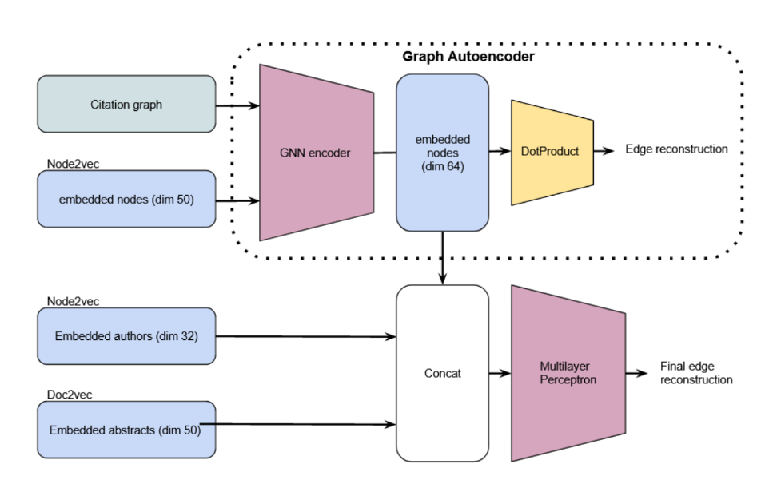
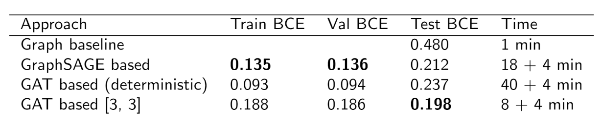

# MVA ALTEGRAD Kaggle Challenge 2021: Citation Prediction

This repository contains our work for the Kaggle challenge the Advanced Learning for Text and Graph data (ALTEGRAD) course : https://www.kaggle.com/c/altegrad-2021/overview

Work by  : 
 - Akesbi Kamil 
 - Beauté Rémy 
 - Dutot Grégoire 
 
## Competition overview : 

Link prediction is the problem of predicting the existence of a link between two entities in a network.

The problem of link prediction has recently attracted a lot of attention in many domains. For instance, in social networks, one may be interested in predicting friendship links among users, while in biology, predicting interactions between genes and proteins is of paramount importance.

In this challenge, we had to deal with the problem of predicting whether a research paper cites another research paper. More specifically, we were given a citation network consisting of several thousands of research papers, along with their abstracts and their list of authors. The pipeline that is typically followed to deal with the problem is similar to the one applied in any classification problem, the goal is to use edge information to learn the parameters of a classifier and then to use the classifier to predict whether two nodes are linked by an edge or not.

## Our work : 

In this repository, we present the main approaches we
tested for the MVA Altegrag 2022 Kaggle challenge. The goal is to
predict wheter a research paper cites another research paper. We
embedded information about the papers thanks to unsupervised
framework. We also implemented a GNN encoder to produce
more fine-tuned embeddings. These embeddings are finally fed to
a Multilayer Perceptron that predicts the probability of two nodes
being linked to one another. We achieve quite good performance
on the prediction task and observe the efficiency of fixed-size
neighborhood sampling to adapt the GAE framework to large
graphs.

## Setup : 

`pip -r install requirements`

## Architecture : 

## Results : 

